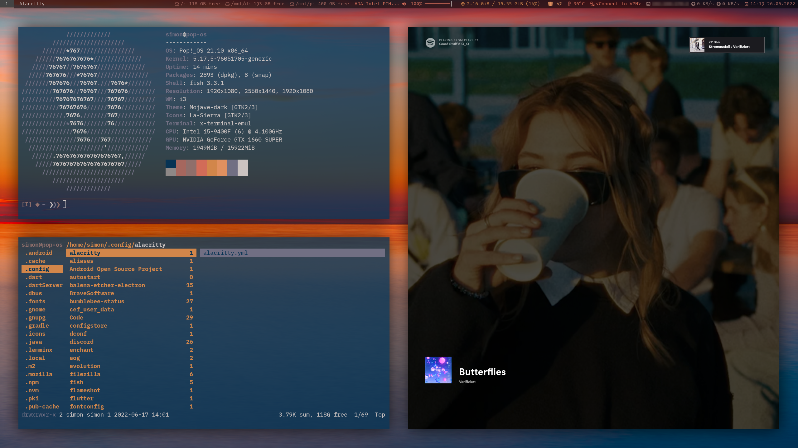

# dotfiles :paintbrush:



## prerequisites

* i3-gaps, a fork of i3wm, a tiling window manager for X11: [github.com/Airblader/i3](https://github.com/Airblader/i3)
  * [Build and installation guide](https://github.com/Airblader/i3/wiki/Building-from-source)
* autotiling, a script that uses the i3ipc-python library to switch the layout splith/splitv depending on the currently focused window dimensions: [github.com/nwg-piotr/autotiling](https://github.com/nwg-piotr/autotiling)
* GTK+ themes and icons:
  * [Sierra Gtk Theme](https://github.com/vinceliuice/Sierra-gtk-theme)
  * [Mojave Gtk Theme](https://github.com/vinceliuice/Mojave-gtk-theme)
  * [Apple Cursor](https://github.com/ful1e5/apple_cursor)
* BlexMono & FiraCode Nerd Fonts: [www.nerdfonts.com](https://www.nerdfonts.com/font-downloads)
* exa, a modern replacement for ls: [github.com/ogham/exa](https://github.com/ogham/exa)
* bat, a cat clone with wings: [github.com/sharkdp/bat](https://github.com/sharkdp/bat)
* oh-my-fish, the fish shell framework: [github.com/oh-my-fish/oh-my-fish](https://github.com/oh-my-fish/oh-my-fish)
* nvm, Node Version Manager: [github.com/nvm-sh/nvm](https://github.com/nvm-sh/nvm)
* pywal, a tool that generates a color palette from the dominant colors in an image: [github.com/dylanaraps/pywal](https://github.com/dylanaraps/pywal)
<!-- * picom, a compositor for X, and a fork of Compton: [github.com/yshui/picom](https://github.com/yshui/picom) -->
* picom, a compositor for X, and a fork of Compton: [github.com/ibhagwan/picom](https://github.com/ibhagwan/picom)
* feh, a light-weight, configurable and versatile image viewer: [github.com/derf/feh](https://github.com/derf/feh)

## setup

Make sure, you've cloned this repository into your home directory, and then execute the `setup.sh` file:

```
~/dotfiles $ ./setup.sh
```

BE AWARE! This will overwrite a lot of your config files in your ~/.config folder!

Enjoy!
